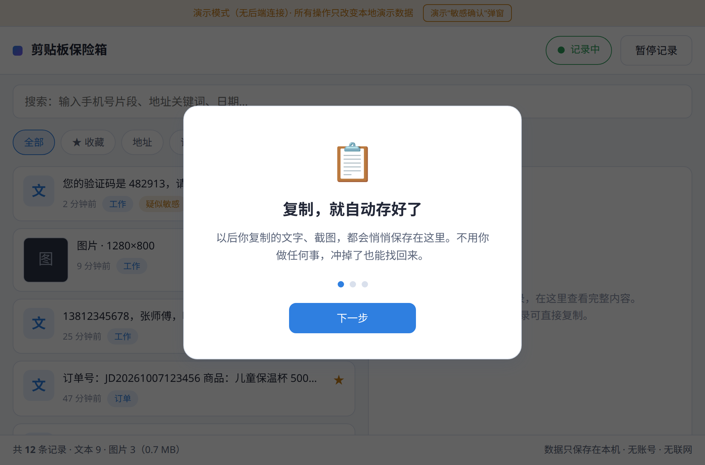
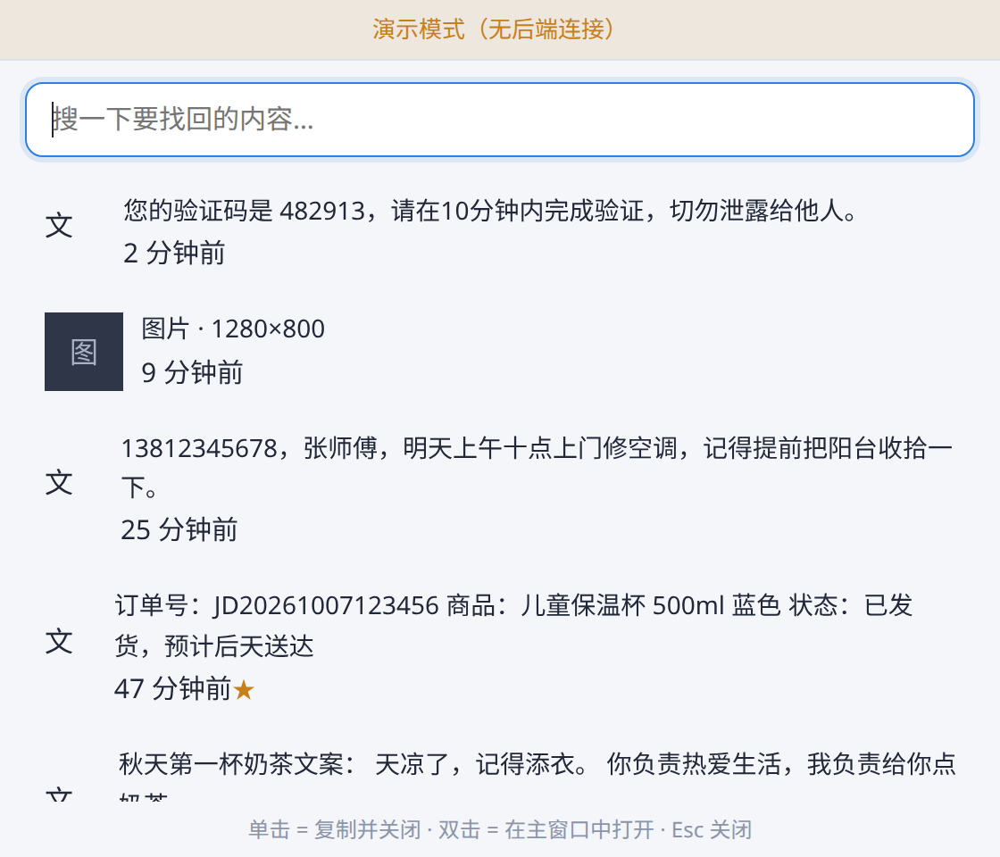
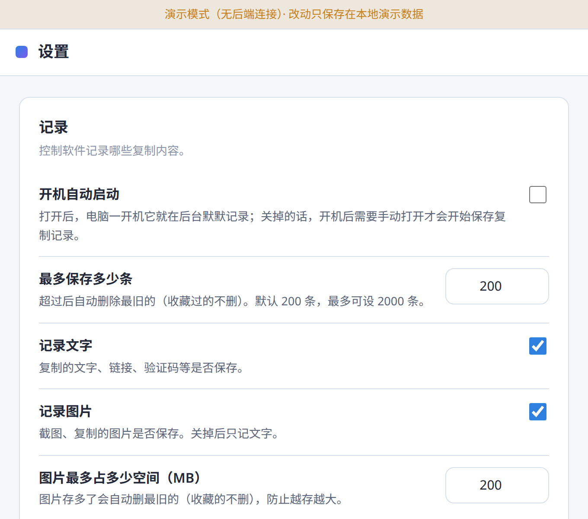
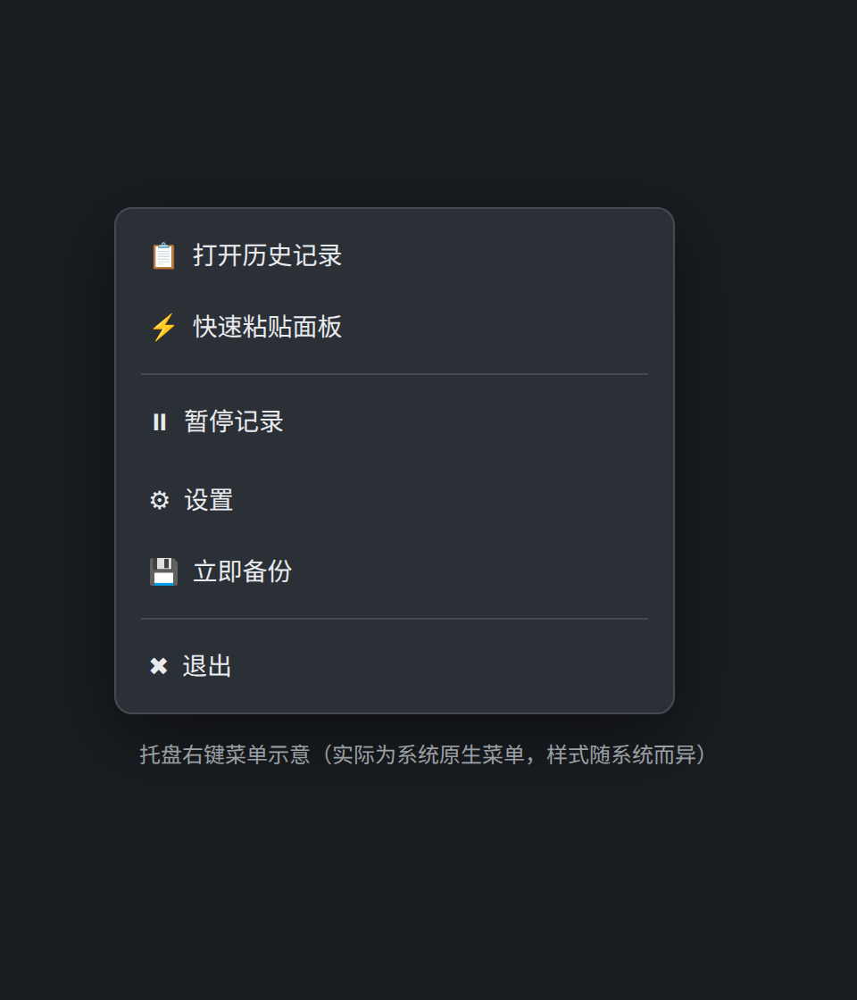

# ClipVault-Local 📋

**纯本地剪贴板历史保险箱** —— 复制的东西被冲掉了？按一下 `Win+Shift+V` 找回来。





> **一句话承诺：你的每一次复制，只存在你自己的电脑里。**
> 无账号、无登录、无云同步、无广告、无内购、无遥测 —— 整个程序没有任何联网行为，
> 连"检查更新"都默认关闭。所有功能开箱全开，MIT 开源。

---

## 这是什么？

每天都会遇到的小崩溃：

- 复制了一段地址 / 手机号 / 订单号 / 验证码，一转头又复制了别的 —— **之前那段没了**
- 电脑一重启，剪贴板清空 —— **昨天复制的全没了**
- 网上同类软件：要么弹广告、要么逼你注册、要么偷偷上传、要么设置复杂到看不懂

ClipVault-Local 就是干这一件事的：**安静地记下你复制过的文字和图片，需要时一键找回来。**
它住在托盘里，不弹窗、不抢焦点、不打扰你。

## 2 分钟快速上手

1. **下载安装**：去右侧 [Releases](../../releases) 下载
   - Windows：`ClipVault-Local-x.x.x.msi`（安装版）或 `*-portable-win64.zip`（绿色版，解压即用）
   - Linux：`.deb`（双击安装）或 `.AppImage`（加执行权限直接运行）
2. **复制点东西**：像往常一样 `Ctrl+C`，右下角托盘图标会默默记下（第一次打开有 3 步小引导）
3. **找回来**：按 `Win+Shift+V`（可改、可关），弹出小面板 → 输入几个字搜索 → **点一下就重新复制好了**
4. **就这么多。** 不用注册，不用登录，不用看教程。

### 托盘右键菜单（系统原生菜单，各电脑样式略有不同，菜单项如下）



- 📋 打开历史记录 / ⚡ 快速粘贴面板
- ⏸ 暂停记录 / ▶ 恢复记录（图标会变，一眼看出是否在记录）
- ⚙ 设置 / 💾 立即备份 / ✖ 退出

## 主要功能（说人话版）

| 你想干嘛 | 怎么干 |
|---|---|
| 找回刚被冲掉的复制 | `Win+Shift+V` → 搜几个字 → 点一下 |
| 只看收藏的重要条目 | 点条目上的 ⭐，以后永不自动删除 |
| 给条目贴标签 | 地址 / 订单 / 工作 / 购物，自己也能加 |
| 截图也找回 | 截图进剪贴板会自动存缩略图，点开看原图、可另存 |
| 暂停一下别记了 | 托盘点"⏸ 暂停记录"，图标立刻变灰 |
| 删干净 | 设置里"一键擦除全部历史" / "擦除最近一小时" |
| 怕密码被记下来 | 默认开启：检测到"密码/验证码"字样会先问你记不记 |
| 换电脑 / 重装 | 设置 → 立即备份 → 得到一个 `.cvbak` 文件，拷走；新电脑上"导入备份" |
| 电脑锁屏时 | 可选：自动暂停记录，或自动清空最近 1 小时（默认关） |
| 给数据库加密码 | 设置里可设（不懂就别碰，默认不加密也完全本地） |

## 常见问题

**会不会偷我的验证码 / 密码？**
不会。程序**没有任何联网代码** —— 不上传、不遥测、不检查更新（更新检查默认关闭，想查自己点）。
所有复制内容只存在你电脑 `文档/ClipVault-Local/` 下的一个数据库文件里。
检测到"密码/验证码"字样时，默认会先弹窗问你"记不记"，你也可以设为自动跳过。

**重装电脑 / 换电脑，怎么迁移记录？**
设置 → **立即备份**，会生成一个 `.cvbak` 单文件备份包（在 `文档/ClipVault-Local/` 里）。
把它拷到新电脑 → 设置 → **导入备份** → 全回来了。
程序每 7 天还会自动在同目录存一份备份（可关）。

**占多大地方？能存多少条？**
默认存最近 200 条（可调到 2000），收藏的不计入淘汰。
图片有独立空间上限（默认 200MB），超了自动删最旧的图片。
**拒绝 Electron，用的 Tauri，轻量。**

**要不要一直开着？**
要。记复制这件事必须有个常驻的小程序。它很省：托盘图标，不弹窗。
想开机就有：设置里打开"开机自启"（会明确告诉你：开机启动后才会保存复制记录）。

**快捷键能改 / 能关吗？**
能。设置里点一下输入框，按你喜欢的组合；点"清除"就是彻底关掉全局热键。
程序**不劫持任何改不了的快捷键**，也不注入浏览器、不读你的文件、不截屏。

**图片存在哪？**
缩略图和原图都存在本地数据库里，不单独散落文件。
导出时会整理成 `entries.json + images/` 文件夹给你。

**卸载干不干净？**
Windows 正常卸载即可；想连记录一起删，卸载前先在设置里点"一键擦除全部历史"，
或手动删掉 `文档/ClipVault-Local/` 文件夹。

---

---

# 开发者部分

## 架构

```
┌─────────────┐  JSON-RPC 2.0 (stdio)   ┌──────────────────┐
│  Tauri 2 外壳 │ ◄────────────────────► │  clipvault-core  │
│  (Rust)       │  换行分隔 JSON          │  (Go, 单静态二进制) │
│  托盘/热键/    │                        │  剪贴板监听/SQLite │
│  窗口/自启     │                        │  加密/备份/锁屏检测 │
└──────┬──────┘                        └──────────────────┘
       │ invoke('core_request')
┌──────▼──────┐
│  前端 (原生 HTML/CSS/JS, 零依赖, 零构建) │
│  index.html 主窗口 / popup.html 快面板   │
│  settings.html 设置页                    │
└─────────────┘
```

- **为什么 Go 做核心？** 单静态文件、无运行库；`modernc.org/sqlite` 纯 Go 无 cgo；
  `golang-design/clipboard` 跨平台剪贴板；业务逻辑（去重/淘汰/加密/备份）全部可单测。
- **为什么 Tauri 2？** 拒绝 Electron；用系统 WebView；
  Rust 只做薄外壳：托盘、全局热键、开机自启、单实例、窗口管理、sidecar 转发。
- **通信协议**：见 [docs/IPC.md](docs/IPC.md)，换行分隔 JSON-RPC 2.0，
  Go 推事件（`entry_added` / `sensitive_prompt` / …），Rust 转发给前端。
- **零网络**：core 与 app 均无任何网络代码；CSP 禁止外部资源；前端零 CDN。

## 目录结构

```
clipvault-local/
├── core/                  # Go 核心 (module: github.com/wangzi5151/clipvault-local/core)
│   ├── main.go            # stdio JSON-RPC 主循环
│   ├── ipc.go             # 方法分发
│   ├── store.go           # SQLite 存储
│   ├── clip.go            # 剪贴板监听 (clip_windows.go / clip_linux.go)
│   ├── sensitive.go       # 敏感词检测
│   ├── crypto.go          # scrypt + AES-256-GCM 可选加密
│   ├── backup.go          # 导出/备份/导入/自动备份
│   ├── lock_*.go          # 锁屏检测 (Windows WTS / Linux D-Bus)
│   └── *_test.go
├── app/
│   ├── dist/              # 前端（直接提交，无构建步骤）
│   │   ├── index.html / popup.html / settings.html
│   │   └── css/ js/
│   └── src-tauri/         # Tauri 2 工程
│       ├── src/main.rs    # 托盘/热键/窗口/sidecar 转发
│       ├── tauri.conf.json
│       └── capabilities/
├── docs/
│   ├── IPC.md             # 通信协议（前后端契约）
│   └── screenshots/
├── scripts/build-sidecar.sh
└── .github/workflows/    # ci.yml / release.yml
```

## 本地构建

```bash
# 1. 构建 Go 核心并放到 sidecar 位置
./scripts/build-sidecar.sh

# 2. 打包（需 Rust 工具链；Windows 产 MSI+NSIS，Linux 产 deb+AppImage）
cd app && npx @tauri-apps/cli build
```

发版：打 tag `v0.1.0` 并 push，GitHub Actions 自动完成
Go 交叉编译 → Tauri 打包 → 创建 Release（含 Windows 便携 zip）。

## 安全设计说明

- 默认数据目录：`文档/ClipVault-Local/clipvault.db`（单文件 SQLite，可一键备份）。
- 可选密码加密：scrypt(32768,8,1) 派生 → AES-256-GCM，每值随机 nonce；
  密码只存于用户脑中，**我们没有任何后门能解开**。
- 导入只认自家 `.cvbak`（zip：db 拷贝 + meta.json），不解析任何第三方私有格式。
- 文本 >1MB、图片解码 >25MB、文件拖放剪贴：直接忽略，防爆库。
- 锁屏检测：Windows 走 WTS session notification，Linux 走 D-Bus ScreenSaver 信号；
  拿不到信号则功能静默不可用，不报错打扰。

## 许可证

MIT，见 [LICENSE](LICENSE)。无内购、无广告、无功能锁 —— 所有功能开箱全开。
